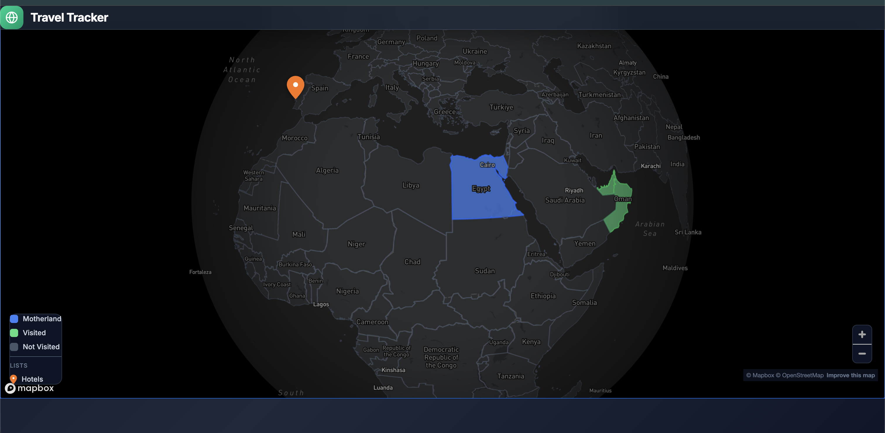

# Travel Tracker

A full-stack interactive travel tracking application that lets you visualize your journeys on a world map. Mark countries as visited, pin specific places, upload photos, and organize everything into custom lists with color-coded markers.

Built with **Spring Boot**, **Angular 19**, **Mapbox GL**, and **MySQL**.

---

## Screenshots



---

## Features

### Public Map View
- Interactive world map powered by **Mapbox GL**
- Countries color-coded by status:
  - **Blue** — Motherland
  - **Green** — Visited
  - **Gray** — Not visited
- Click any country to see its details and saved places
- Place markers with custom colors based on category/list
- Legend showing country statuses and place categories
- Click any place marker to view notes, photos, and visit date

### Admin Panel (JWT Protected)
- **Dashboard** — Stats overview: countries visited, places explored, world coverage %, and last added place
- **Manage Countries** — Search and toggle visited status for 197 countries
- **Manage Places** — Full-screen map with:
  - **Mapbox Geocoder** search (search any place in the world)
  - Click map to drop a pin
  - Auto-fill coordinates, name, and country from search results
  - Add notes, visit date, and photos
  - Organize places into custom **lists/categories** with color picker
  - Edit and delete existing places
  - Image carousel for place photos

### API
- RESTful API with public read endpoints and protected admin endpoints
- JWT authentication with 24-hour token expiration
- Swagger/OpenAPI documentation at `/swagger-ui.html`
- Image upload support (multipart)

---

## Tech Stack

| Layer | Technology |
|-------|-----------|
| **Backend** | Spring Boot 3.2.3, Java 21 |
| **Frontend** | Angular 19, Tailwind CSS 4 |
| **Maps** | Mapbox GL JS, Mapbox Geocoder |
| **Database** | MySQL 8.0 |
| **Auth** | Spring Security + JWT |
| **API Docs** | Springdoc OpenAPI (Swagger) |
| **Containerization** | Docker & Docker Compose |

---

## Project Structure

```
travel-tracker/
├── backend/
│   ├── src/main/java/com/traveltracker/
│   │   ├── config/          # Security, CORS, OpenAPI, DataSeeder
│   │   ├── controller/      # REST controllers (public + admin)
│   │   ├── dto/             # Data Transfer Objects
│   │   ├── entity/          # JPA entities (Country, Place, Image, Admin)
│   │   ├── repository/      # Spring Data JPA repositories
│   │   ├── security/        # JWT filter, token provider, user details
│   │   └── service/         # Business logic layer
│   ├── src/main/resources/
│   │   └── application.yml  # App configuration
│   ├── Dockerfile
│   └── pom.xml
├── frontend/
│   ├── src/app/
│   │   ├── components/      # Reusable UI components
│   │   │   ├── map/         # Mapbox map with GeoJSON country rendering
│   │   │   ├── topbar/      # Navigation bar
│   │   │   ├── sidebar/     # Side navigation
│   │   │   ├── country-detail/  # Country info panel
│   │   │   ├── place-modal/     # Place detail modal
│   │   │   └── stats-card/      # Dashboard stat cards
│   │   ├── pages/
│   │   │   ├── home/        # Public map view
│   │   │   └── admin/
│   │   │       ├── login/       # Admin login
│   │   │       ├── dashboard/   # Stats dashboard
│   │   │       ├── manage-countries/  # Country management
│   │   │       └── manage-places/     # Place management with map
│   │   ├── models/          # TypeScript interfaces
│   │   ├── services/        # API service, auth service, interceptor
│   │   └── guards/          # Auth route guard
│   ├── src/environments/    # Environment config (Mapbox token)
│   ├── Dockerfile
│   └── package.json
├── docker-compose.yml
└── README.md
```

---

## API Endpoints

### Public (No Auth)

| Method | Endpoint | Description |
|--------|----------|-------------|
| `POST` | `/api/auth/login` | Admin login, returns JWT |
| `GET` | `/api/countries` | List all countries |
| `GET` | `/api/countries/{id}` | Get country by ID |
| `GET` | `/api/places` | List all places (optional `?countryId=`) |
| `GET` | `/api/places/{id}` | Get place by ID |
| `GET` | `/api/stats` | Travel statistics |

### Admin (JWT Required)

| Method | Endpoint | Description |
|--------|----------|-------------|
| `PUT` | `/api/admin/countries/{id}/toggle-visit` | Toggle visited status |
| `POST` | `/api/admin/places` | Create place |
| `PUT` | `/api/admin/places/{id}` | Update place |
| `DELETE` | `/api/admin/places/{id}` | Delete place |
| `POST` | `/api/admin/places/{placeId}/images` | Upload image |
| `DELETE` | `/api/admin/places/images/{imageId}` | Delete image |

---

## Database Schema

```
┌──────────────┐       ┌──────────────┐       ┌──────────────┐
│   Country    │       │    Place     │       │    Image     │
├──────────────┤       ├──────────────┤       ├──────────────┤
│ id           │──┐    │ id           │──┐    │ id           │
│ name         │  │    │ name         │  │    │ url          │
│ code (ISO)   │  └───>│ country_id   │  └───>│ place_id     │
│ visited      │       │ description  │       │ fileName     │
│ color        │       │ latitude     │       └──────────────┘
└──────────────┘       │ longitude    │
                       │ visitDate    │       ┌──────────────┐
                       │ category     │       │    Admin     │
                       │ categoryColor│       ├──────────────┤
                       └──────────────┘       │ id           │
                                              │ username     │
                                              │ password     │
                                              └──────────────┘
```

---

## Getting Started

### Prerequisites
- Java 21
- Node.js 18+
- MySQL 8.0 (or Docker)
- Mapbox account ([mapbox.com](https://www.mapbox.com/)) for a free access token

### 1. Clone the Repository

```bash
git clone git@github.com:m0stafa7med/travel-tracker.git
cd travel-tracker
```

### 2. Setup Mapbox Token

```bash
cp frontend/src/environments/environment.example.ts frontend/src/environments/environment.ts
```

Edit `environment.ts` and add your Mapbox public token:
```typescript
export const environment = {
  production: false,
  mapboxToken: 'pk.your_mapbox_token_here',
  apiUrl: 'http://localhost:8080/api'
};
```

### 3. Start MySQL

Using Docker:
```bash
docker run -d --name travel-tracker-db \
  -e MYSQL_ROOT_PASSWORD=root \
  -e MYSQL_DATABASE=travel_tracker \
  -p 3306:3306 mysql:8.0
```

Or use an existing MySQL instance and update `backend/src/main/resources/application.yml`.

### 4. Run Backend

```bash
cd backend
mvn spring-boot:run
```

Backend starts on `http://localhost:8080`

### 5. Run Frontend

```bash
cd frontend
npm install
ng serve
```

Frontend starts on `http://localhost:4200`

### 6. Login as Admin

- URL: `http://localhost:4200/admin/login`
- Username: `admin`
- Password: `admin123`

---

## Deploy with Docker Compose

The easiest way to deploy everything at once:

```bash
# Set your Mapbox token in the frontend environment file first
docker-compose up -d --build
```

This starts:
- **MySQL** on port `3306`
- **Backend** on port `8080`
- **Frontend** on port `4200`

### Production Deployment (VPS with Traefik)

This project integrates with an existing **Traefik** reverse proxy for automatic HTTPS.

#### 1. Clone on Server
```bash
cd ~/projects
git clone git@github.com:m0stafa7med/travel-tracker.git
cd travel-tracker
```

#### 2. Create `.env`
```bash
cat > .env << 'EOF'
DB_PASSWORD=YourStrongDBPassword
JWT_SECRET=YourSuperSecretKeyForJWTTokenGenerationMustBeAtLeast256BitsLong!!
MAPBOX_TOKEN=pk.your_mapbox_public_token
EOF
```

#### 3. Deploy
```bash
docker compose -f docker-compose.prod.yml up -d --build
```

Traefik automatically provisions an SSL certificate via Let's Encrypt for `travel.mostafadarwesh.com`.

### CI/CD Pipeline (GitHub Actions)

Auto-deploys on every push to `main`. Add these **GitHub Secrets**:

| Secret | Description |
|--------|-------------|
| `SERVER_IP` | VPS IP address |
| `SERVER_USER` | SSH username (e.g. `root`) |
| `SSH_PRIVATE_KEY` | SSH private key for authentication |
| `DB_PASSWORD` | MySQL root password |
| `JWT_SECRET` | JWT signing key (min 256 bits) |
| `MAPBOX_TOKEN` | Mapbox public access token |

### DNS Setup
Add an **A record** for `travel.mostafadarwesh.com` pointing to your server IP.

---

## Environment Variables

| Variable | Default | Description |
|----------|---------|-------------|
| `DB_PASSWORD` | `StrongPassword123!` | MySQL root password |
| `JWT_SECRET` | (set in application.yml) | JWT signing key |
| `MAPBOX_TOKEN` | — | Mapbox public access token |

---

## UI Design

- **Dark theme** with slate color palette
- **Glassmorphism** cards with frosted glass effect
- **Smooth animations** — fade-in, slide-up with staggered delays
- **Responsive** layout
- **Color-coded** map with interactive country polygons

---

## License

This project is for personal use.
